<a href="https://infinite.si">
  <h1 align="center">
    <picture>
      <source media="(prefers-color-scheme: dark)" srcset="./.github/imgs/banner.png">
      
    </picture>
  </h1>
</a>

<div align="center">
<a title="Code Quality" href="https://www.codefactor.io/repository/github/infinitehq/cherry"></a>
  <a title="Discord Server" href="https://discord.gg/H2wptkecUg"></a>
<a title="'Linux Build' workflow Status" href="https://img.shields.io/github/actions/workflow/status/infiniteHQ/cherry/build.yml"></a>
</div>

> *Important: Cherry is part of [Infinite](https://infinite.si/)'s initiative to create free, independent, and ethical technology and computing. Cherry is a library powering many parts of this project, but maintaining libraries like Cherry is a time-consuming and costly process. If you appreciate Cherry, you can support us [on our funding page](https://fund.infinite.si/) if you can.*

<p align="center" style="gap: 0; margin-bottom: 6px;">
  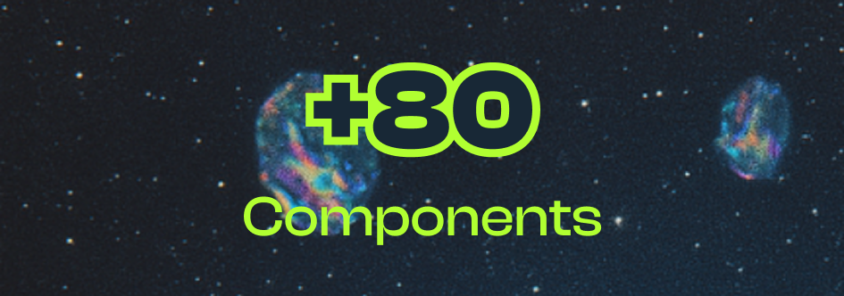
  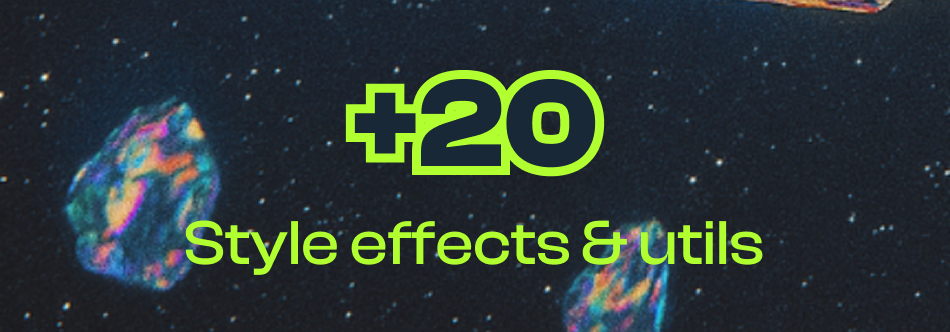
</p>
<p align="center" style="gap: 0;">
  <a target="_blank" href="https://cherry.infinite.si">
    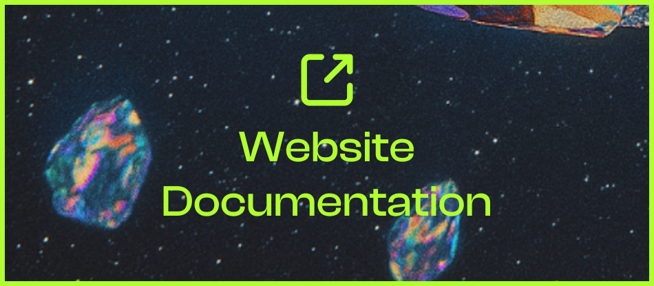
  </a>
  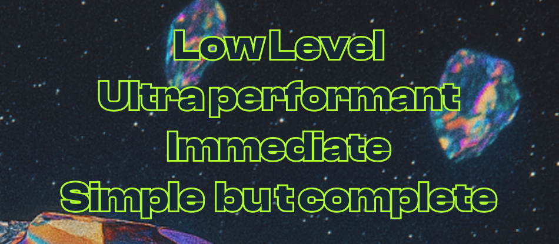
</p>


### Summary
*Cherry is a modern, minimalist yet comprehensive UI/UX framework for low-level native applications. It provides a complete solution, including backend support, a rendering engine, and UI components. Cherry is built using technologies like ImGui, Vulkan, and SDL, offering developers advanced tools to create efficient and high-performance interfaces.*

*A presentation video will be apear here*

## What you can do ?  


## Features

> ***(Top level)* Components, UI, Interfaces & Kits**
> - 🧰 **+ 80 Components**, easy and ready to use
> - 🧰 **+ 20 Style effects and utils**, like color, sizes, padding, layout managment
> - 📦 **Many examples** and ready to use windows
> - 📦 **Many logics and interaction** utils like input detection, key managment, double click, Ctrl+C etc...

> ***(API)* Render engine**
> - 📈 Data handler for windows & components
> - 🔊 Sound engine
> - 💬 Localization & Traduction managment
> - 🎨 Themes manager, Dark & Ligth themes
> - ❓ Fonts manager
> - 🖼️ Images & textures manager
> - 🗂️ Menubar & Bottombar simple callbacks
> - 💪 Custom window close behaviors
> - 🗄️ Advanced Docking (WIP)
> - 🖼️ Toasts, Notifications & pop-ups
> - 🛠️ Behaviros callbacks (closing, moving, etc...)
> - 🏗️ Windows customisations (size, colors, properties & styles)

> **Backends**
> - 🛠️ Multi context with contexts cohesion & communication (ImGui/SDL)
> - 🛠️ Complete image load & show, cache & optimization
> - 🛠️ Window builder


> **Planned features for next updates :**
> - 🏗️ Webviews & Website loading
> - 🏗️ More components with more properties & customizations
> - 🏗️ Internet images loading & cache managment


> [!NOTE]  
> This framework is new and still under active development, so some bugs may occur, and content is subject to change. We are also working to improve the overall stability of Cherry, particularly with regard to memory safety and the rendering stack, as well as the graphical libraries used. Thank you for your understanding! Stay tuned :)

## Getting started
> [!WARNING]  
> The only dependance you need to compile Cherry is the VulkanSDK installed & ready. Please refer to the https://www.lunarg.com/vulkan-sdk/ website to see how install Vulkan on your system (compatible on Linux & Windows).


> 🪟 On **Microsoft Windows**
> ``` powershell
> git clone https://github.com/infiniteHQ/Cherry
> cd Cherry
> git checkout 1.2
> git submodule update --init --recursive
> cd examples/demo
> build.bat
> .\build\bin\demo.exe
> ```

> 🐧 On **Linux** based distributions
> ``` bash
> git clone https://github.com/infiniteHQ/Cherry
> cd Cherry
> git checkout 1.2 # Latest release
> git submodule update --init --recursive
> cd examples/demo
> bash build.sh
> ./build/bin/demo
> ```

*Congratulations! If everything is working well, you can now start in the Cherry environment. Please follow our documentation (WIP). If you encounter any issues, feel free to ask your question or reach out to us on Discord!*


<h2>Compatibility</h2>

<table style="width:100%;">
  <tr>
    <th>Technology</th>
    <th>Windows</th>
    <th>Linux</th>
    <th>Linux DRM</th>
    <th>macOS</th>
    <th>iOS</th>
    <th>Android</th>
    <th>Web</th>
  </tr>
  <tr>
    <td><strong>Vulkan</strong></td>
    <td>✅</td>
    <td>✅</td>
    <td>🟧</td>
    <td>🟧</td>
    <td>❌</td>
    <td>❌</td>
    <td>❌</td>
  </tr>
</table>

<p style="font-size: 12px;">
✅ <em>: Fully compatible</em><br>
🟧 <em>: Not fully tested, partially incompatible but planned</em><br>
❌ <em>: Not planned, incompatible (for the moment...)</em>
</p>


## Examples & Preview
  
> [!NOTE]  
> These examples are real-world examples of the use of Cherry. More examples will be uploaded.
<table>
  <tr>
    <td align="center">
      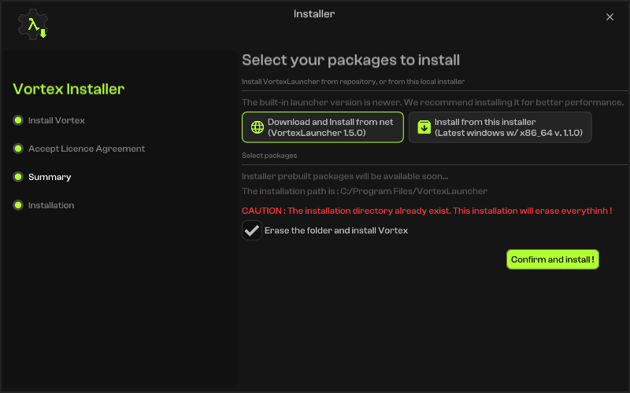
      <p>Simple window with sidebar</p>
    </td>
    <td align="center">
      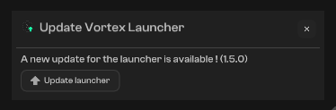
      <p>Toast notification</p>
    </td>
    <td align="center">
      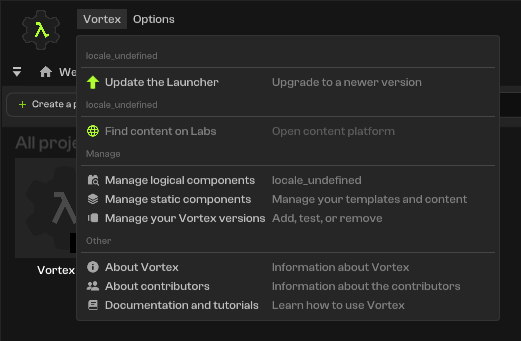
      <p>Rich menubar</p>
    </td>
  </tr>
  <tr>
    <td align="center">
      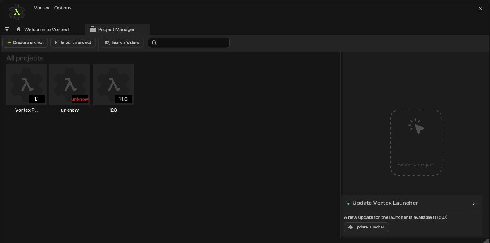
      <p>Project selector with custom widgets</p>
    </td>
    <td align="center">
      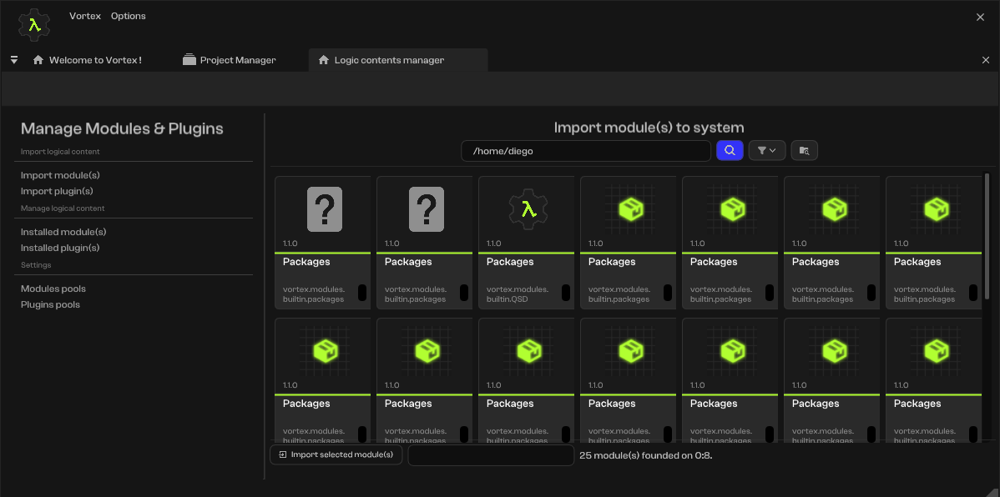
      <p>Item selection & navigation</p>
    </td>
    <td align="center">
      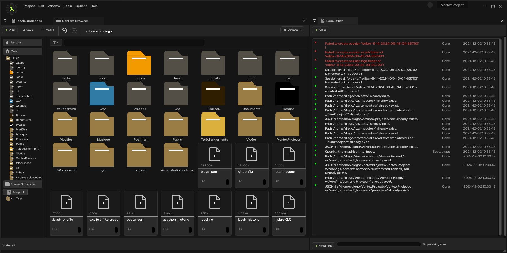
      <p>Rich windows & Docking</p>
    </td>
  </tr>
  <tr>
    <td align="center">
      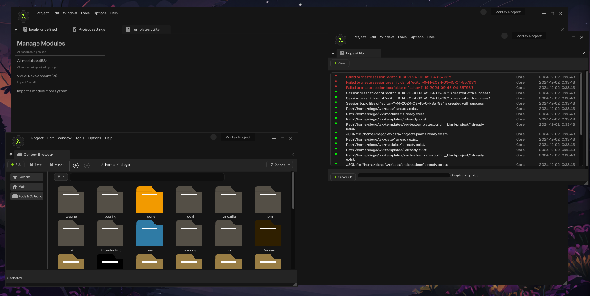
      <p>Multi-windows on single app</p>
    </td>
  </tr>
</table>

## Special thanks
- For all contributors of SDL2
- For all contributors of Vulkan/VulkanSDK
- For all contributors of STB
- For the log library of gabime and contributors (https://github.com/gabime/spdlog)
- For the json library of nlohmann and contributors (https://github.com/nlohmann/json)
- For the amazing immediate mode interface ImGui from Ocornut and contributors (https://github.com/ocornut/imgui)
- For the work of from "Studio Cherno" on Walnut (https://github.com/StudioCherno/Walnut)
