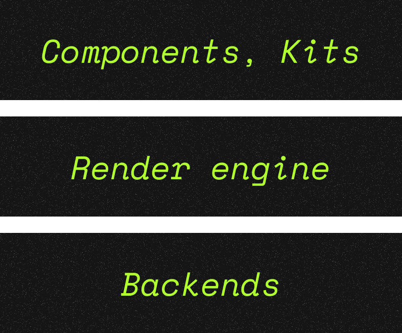

<a href="https://infinite.si">
  <h1 align="center">
    <picture>
      <source media="(prefers-color-scheme: dark)" srcset="./.github/imgs/banner.png">
      
    </picture>
  </h1>
</a>

<div align="center">
<a title="Code Quality" href="https://www.codefactor.io/repository/github/infinitehq/uikit"></a>
  <a title="Discord Server" href="https://discord.gg/H2wptkecUg"></a>
<a title="'Linux Build' workflow Status" href="https://img.shields.io/github/actions/workflow/status/infiniteHQ/uikit/build.yml"></a>
</div>


### Summary
*Cherry is a modern, minimalist yet comprehensive UI/UX framework for low-level native applications. It provides a complete solution, including backend support, a rendering engine, and UI components. Cherry is built using technologies like ImGui, Vulkan, and SDL, offering developers advanced tools to create efficient and high-performance interfaces.*

### About tech

<div style="display: flex; align-items: center;">
  <picture>
    <source media="(prefers-color-scheme: dark)" srcset="./.github/imgs/stack.png">
    
  </picture>
  <div style="margin-left: 20px;">
    Cherry provides 3 main components, the first is complete backends to handle the Vulkan initialization, the sdl surface creation and the imgui initialization. Theses backends
  </div>
</div>


> [!NOTE]  
> This framework is new and still under active development, so some bugs may occur, and content is subject to change. We are also working to improve the overall stability of Cherry, particularly with regard to memory safety and the rendering stack, as well as the graphical libraries used. Thank you for your understanding! Stay tuned :)

## Features

> **Components & Kits**
> - 🧰 Many single components ready to use with data managment
> - 📦 Many all in one windows, ready to use and manage
> - 📦 ImGui abstractions for simplicity
> - 📦 Short inlines components

> **Render engine**
> - 📈 Data handler for windows & components
> - 💬 Localization & Traduction managment
> - 🎨 Themes manager
> - ❓ Fonts manager
> - 🖼️ Images & textures manager
> - 🗂️ Menubar & Bottombar simple callbacks
> - 💪 Custom window close behaviors
> - 🗄️ Advanced Docking (WIP)
> - 🏗️ Windows customisations (size, colors, properties & styles)

> **Backends**
> - 🛠️ Multi context with contexts cohesion & communication (ImGui/SDL)
> - 🛠️ Complete image load & show
> - 🛠️ Window builder


## Getting started
> [!WARNING]  
> The only dependance you need is the VulkanSDK installed & ready. Please refer to the https://www.lunarg.com/vulkan-sdk/ website to see how install Vulkan on your system (compatible on Linux & Windows).


> 🪟 On **Microsoft Windows**
> ```
> git clone https://github.com/infiniteHQ/Cherry
> cd Cherry
> git submodule update --init --recursive
> cd example/demo
> build.bat
> ```


> 🐧 On **Linux** based distributions
> ```
> git clone https://github.com/infiniteHQ/Cherry
> cd Cherry
> git submodule update --init --recursive
> cd example/demo
> bash build.sh
> ```


## Documentation
The documentation is in progress...

## Special thanks
- For all contributors of SDL2
- For all contributors of Vulkan/VulkanSDK
- For all contributors of STB
- For the log library of gabime and contributors (https://github.com/gabime/spdlog)
- For the json library of nlohmann and contributors (https://github.com/nlohmann/json)
- For the amazing immediate mode interface ImGui from Ocornut and contributors (https://github.com/ocornut/imgui)
- For the work of from "Studio Cherno" on Walnut (https://github.com/StudioCherno/Walnut)
