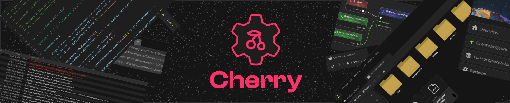
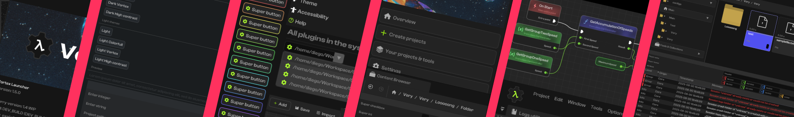
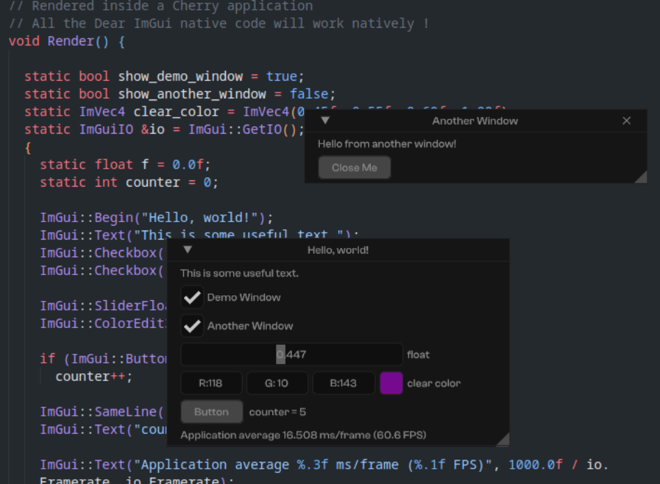
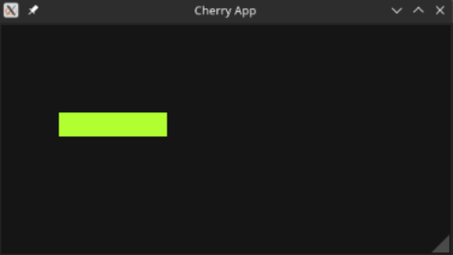
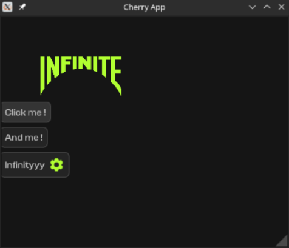
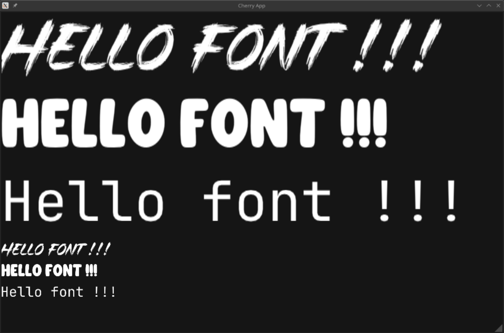

<a href="https://cherry.infinite.si">
  <h1 align="center">
    <picture>
      <source media="(prefers-color-scheme: dark)" srcset="./.github/imgs/b3.png">
      
    </picture>
  </h1>
</a>

<div align="center">
<a title="Code Quality" href="https://www.codefactor.io/repository/github/infinitehq/cherry"></a>
  <a title="Discord Server" href="https://discord.gg/H2wptkecUg"></a>
<a title="'Linux Build' workflow Status" href="https://img.shields.io/github/actions/workflow/status/infiniteHQ/cherry/build.yml"></a>
    <a title="Changelog" href="https://changelogs.infinite.si/cherry"></a>

  <a title="Latest Release" href="https://github.com/infiniteHQ/Cherry/releases/latest"></a>
  <a title="Documentation" href="https://cherry.infinite.si/"></a>

</div>

### What is Cherry ?

**Cherry is a modern, powerfull and simple C++/Lua library for building cross-platform application or cool user interfaces.**

Whether you’re a beginner or an experienced developer, Cherry makes it easy to create real, efficient, and professional interfaces. 

<a href="https://cherry.infinite.si">
  <h1 align="center">
    <picture>
      <source media="(prefers-color-scheme: dark)" srcset="./.github/imgs/b2.png">
      
    </picture>
  </h1>
</a>

> *Important: Cherry is part of [Infinite](https://infinite.si/)'s initiative to create free, independent, and ethical technology and computing. Cherry is a library powering many parts of this project, but maintaining libraries like Cherry is a time-consuming and costly process. If you appreciate Cherry, you can support us [on our funding page](https://fund.infinite.si/) if you can.*


# Table of Contents
- [**Main goals**](#main-goals)
- [**Use cases & Compatibility**](#use-cases-and-compatibility)
- [**Features**](#features)
  - [**Dear ImGui native compatibility**](#dear-imgui-native-compatibility)
  - [**Lua Scripting**](#lua-scripting)
  - [**Sound engine**](#sound-engine)
  - [**Drawing API**](#drawing-api)
  - [**Images/Textures**](#imagestextures)
  - [**Fonts**](#fonts)
  - [**I/O API**](#io-api)
  - [**Hooks**](#hooks)
  - [**Translation and accessibility**](#translation-and-accessibility)
  - [**Themes builder**](#themes-builder)
  - [**Components & Widgets builder**](#components--widgets-builder)
  - [**Customization abilities**](#customization-abilities)
  - [**Network fetch**](#network-fetch)
  - [**Advanced docking**](#advanced-docking)
  - [**Markdown renderer**](#markdown-renderer)
  - [**Choose your features**](#choose-your-features)
  - [**Multiple Dear Imgui Context**](#multiple-dear-imgui-context)
  - [**Compute shaders**](#compute-shaders)
  - [**KMS/DRM Rendering**](#kms-drm-rendering)
  - [**Debug tools**](#debug-tools)
  - [**Builtin components**](#builtin-components)
  - [**Builtin themes**](#builtin-themes)
- [**Used concepts**](#used-concepts)
  - [**Immediate mode (imgui)**](#immediate-mode-imgui)
  - [**Retained mode (classic gui)**](#retained-mode-classic-gui)
  - [**Semi-static rendering**](#semi-static-rendering)
- [**Get started**](#get-started)
- [**Projects using Cherry**](#projects-using-cherry)
- [**Choices and style**](#choices-and-style)
- [**Special Thanks**](#special-thanks)

## Main goals
Cherry philosophy is to provide a powerfull library to make applications and interfaces, it's avoids heavy web technologies and bloated solutions, focusing instead on being simple yet complete, powered by **ImGui, Vulkan, and SDL**.  
Whether you’re a beginner or an experienced developer, Cherry makes it easy to create real, efficient, and professional interfaces. 

## Use cases and Compatibility

<h4>Use cases :</h4>

- Cherry is perfect to create tools with a complete interface quickly.
- Cherry is capable of making advanced and complexe user interfaces for applications or softwares.

 
<h4>Compatibility :</h4>

<table style="width:100%;">
  <tr>
    <th>Technology</th>
    <th>Windows</th>
    <th>Linux</th>
    <th>Linux DRM</th>
    <th>macOS</th>
    <th>iOS</th>
    <th>Android</th>
    <th>Web</th>
  </tr>
  <tr>
    <td><strong>Vulkan</strong></td>
    <td>✅</td>
    <td>✅</td>
    <td>🟧</td>
    <td>✅</td>
    <td>❌</td>
    <td>❌</td>
    <td>❌</td>
  </tr>
</table>

<p style="font-size: 12px;">
✅ <em>: Fully compatible</em><br>
🟧 <em>: Not fully tested, partially incompatible but planned</em><br>
❌ <em>: Not planned, incompatible (for the moment...)</em>
</p>

# Features

The following section will show you a little bit about the main features of Cherry. You will see some short videos, GIFs, or even examples to explain more about Cherry.

## Dear ImGui Native Compatibility

Cherry has native compatibility with [Dear ImGui](https://github.com/ocornut/imgui)! That means you can directly add Dear ImGui code into your Cherry application rendering, and it will work just perfectly.

``` cpp
// Rendered inside a Cherry application
// All the Dear ImGui native code will work natively !
void Render() {
  
  static bool show_demo_window = true;
  static bool show_another_window = false;
  static ImVec4 clear_color = ImVec4(0.45f, 0.55f, 0.60f, 1.00f);
  static ImGuiIO &io = ImGui::GetIO();
  {
    static float f = 0.0f;
    static int counter = 0;

    ImGui::Begin("Hello, world!");  
    ImGui::Text("This is some useful text.");
    ImGui::Checkbox("Demo Window", &show_demo_window);
    ImGui::Checkbox("Another Window", &show_another_window);

    ImGui::SliderFloat("float", &f, 0.0f, 1.0f);
    ImGui::ColorEdit3("clear color", (float *)&clear_color);
    
    if (ImGui::Button("Button")) 
      counter++;

    ImGui::SameLine();
    ImGui::Text("counter = %d", counter);

    ImGui::Text("Application average %.3f ms/frame (%.1f FPS)", 1000.0f / io.Framerate, io.Framerate);
    ImGui::End();
  }

  if (show_another_window) {
    ImGui::Begin("Another Window", &show_another_window);  
    
    ImGui::Text("Hello from another window!");
    if (ImGui::Button("Close Me"))
      show_another_window = false;
    ImGui::End();
  }
}
```

Result :

<picture>
  
</picture>

> In fact, Cherry uses [Dear ImGui](https://github.com/ocornut/imgui) to render interfaces internally. We added many abstractions to allow you to create interfaces without Dear ImGui, just with simple high-level features, components, or widgets. But it is highly modular.

## Lua Scripting

Cherry has an entire [Lua](https://www.lua.org/about.html) scripting engine. You don't want to create interfaces with C++? You can script your applications and tools with Lua. In fact, the Lua scripting engine of Cherry embeds most of Cherry's logic and drawing features such as capturing I/O, playing sounds, drawing rectangles, or creating widgets and components.

> Cherry programming with C++ = (code, compilation, wait, run and see)

> Cherry programming with Lua = (code, ... that's it! Just see the result)

`Preview :`

https://github.com/user-attachments/assets/38e9b5f2-d8e2-430d-89c7-ac0071e98f2a


## Sound Engine

Cherry embeds a sound engine powered by [miniaudio](). Cherry adds more layers to create channels and run sounds or music easily.


`Simple approach :`
```cpp
// Play a sound
CherryApp.PlaySound(CherryPath("resources/audio/tick.wav"));
```

`Advanced approach :`
```cpp
// Create and populate sound channels
CherryApp.CreateChannel("SFX");
CherryApp.GetChannel("SFX")->AddSound(CherryPath("resources/audio/tick.wav"));
CherryApp.GetChannel("SFX")->AddSound(CherryPath("resources/audio/tack.wav"));

// Play once
CherryApp.GetChannel("SFX")->PlayTick();

// Start Loop
CherryApp.GetChannel("SFX")->Play();

// Stop Loop
CherryApp.GetChannel("SFX")->Stop();
```

## Drawing API

Cherry has a high-level and simple-to-use drawing API, available in Lua and C++. With it, you can draw shapes and primitive forms, and bring life to your interfaces.

> Simple example using C++ drawing API
```cpp
void Render() {
  float x = 50.0f;
  float y = 75.0f;
  float w = 90.0f;
  float h = 20.0f;
  std::string color = "#B1FF31";
  CherryDrawing::RectWindow(Cherry::Vec2(x, y), Cherry::Vec2(w, h), color);
}
```
Result :

<picture>
  
</picture>

> More advanced example using C++ drawing API


> This is the [examples/concepts/drawing](https://github.com/infiniteHQ/Cherry/tree/main/examples/concepts/drawing) example of this repository ! You can check the code [here](https://github.com/infiniteHQ/Cherry/tree/main/examples/concepts/drawing)

## Images/Textures

Cherry embeds a high-level and secure image and texture loader, compatible with multiple contexts of Dear ImGui.

`Example using images in components :`
```cpp  
CherryStyle::AddMarginX(50.0f);
CherryStyle::AddMarginY(50.0f);
CherryKit::ImageLocal(CherryPath("resources/images/infinite.png"), 100.0f, 50.0f);

CherryKit::ButtonText("Click me !");
CherryKit::ButtonText("And me !");
CherryKit::ButtonTextImage("Infinityyy", CherryPath("resources/images/settings.png"));
```

<picture>
  
</picture>

You can also use Cherry to get native Dear ImGui textures :
`This is how :`
```cpp
ImTextureID t = Cherry::GetTexture(CherryPath("resources/images/infinite.png"));
```

## Fonts

Cherry supports font loading and setup. You can easily add new fonts and bring them to your interfaces.

> Cherry support TTF and OTF files

<picture>
  
</picture>

```cpp
void Render() {
  Cherry::PushFont("rocket");
  CherryKit::TitleOne("Hello font !!!");
  Cherry::PopFont();

  Cherry::PushFont("chunky");
  CherryKit::TitleOne("Hello font !!!");
  Cherry::PopFont();

  Cherry::PushFont("jetbrainsmono");
  CherryKit::TitleOne("Hello font !!!");
  Cherry::PopFont();
}

CherryApplication CherryMain(int argc, char **argv) {
  Cherry::ApplicationSpecification config;
  auto app = new CherryApplication(config);
  
  // Add OTF files
  app->AddFont("rocket", CherryPath("rocket.otf"), 80.0f);
  app->AddFont("chunky", CherryPath("chunky.otf"), 80.0f);
  // Add TTF files
  app->AddFont("jetbrainsmono", CherryPath("jetbrainsmono.ttf"), 80.0f);

  return app;
}
```

## I/O API

Cherry embeds an Inputs/Outputs API to quickly get user actions, key presses, mouse actions, etc.

```cpp
  if (CherryApp.IsKeyPressed(Cherry::CherryKey::Z)) {
    // code here
  } 
  
  if (CherryApp.IsKeyPressed(Cherry::CherryKey::CTRL)) {
    // code here
  }
  
  if (CherryApp.IsMouseClicked(0)) {
    // left click
  }

  if (CherryApp.IsMousePressed(0)) {
    // left mouse button pressed
  }
```

## Hooks

Cherry gives you the possibility of creating hooks in your code. A hook is an independant process that will be calculated during frames or every second. Hooks can process animation data, compute shader results, etc.

> The following example will calculate an active RGB color, and display the color in the text.
```cpp
// Before render
auto foo = CherryHook({
    static float hue = 0.0f;

    hue += 0.01f;
    if (hue > 1.0f)
        hue = 0.0f;

    float r = 0.f, g = 0.f, b = 0.f;

    float h = hue * 6.0f;
    int sector = (int)h;
    float f = h - sector;

    float q = 1.0f - f;
    float t = f;

    switch (sector % 6)
    {
        case 0: r = 1.f; g = t;   b = 0.f; break;
        case 1: r = q;   g = 1.f; b = 0.f; break;
        case 2: r = 0.f; g = 1.f; b = t;   break;
        case 3: r = 0.f; g = q;   b = 1.f; break;
        case 4: r = t;   g = 0.f; b = 1.f; break;
        case 5: r = 1.f; g = 0.f; b = q;   break;
    }

    int R = (int)(r * 255.0f);
    int G = (int)(g * 255.0f);
    int B = (int)(b * 255.0f);

    char hex[8];
    snprintf(hex, sizeof(hex), "#%02X%02X%02X", R, G, B);

    self->SetData("color", hex);
});

Cherry::CreateHook("rgb_channel", CherryHookSecond, foo);
 
// Render
void Render() {
std::string color = Cherry::GetHookData(CherryID("rgb_channel"), "color");
}
```
There is the result :


> The following example will create a hook that counts the number of clicks on the button "btn".
```cpp
// Before render
auto foo = CherryHook({
  static int i = 0;
  i++;
  self->SetData("clicked", std::to_string(i));
});

auto cond = CherryHookCond({
  if (CherryApp.GetComponent(CherryID("btn")).GetDataAs<bool>("isClicked")) {
    return true;
  }
    return false;
});

Cherry::CreateHook("btn_number_of_clicks", CherryHookFrame, foo, cond);
 
// Render
void Render() {
CherryKit::ButtonText(CherryID("btn"), "button");

std::string val = Cherry::GetHookData(CherryID("btn_number_of_clicks"), "clicked");
}
```

## Translation and Accessibility

Cherry has an advanced translation and locales system, allowing you to adapt your software, tool, or app to many languages in the world.

This is the format Cherry uses for locales. Everything is in a JSON file.
```json
{
    "locales": [ 
        {"hello_world":"Hello world !"}
    ]
}
```

And there is how we interact with locales files !
```cpp
void Render() {
  // You can change the selected language dynamically
  if (CherryKit::ButtonText("Change for English").GetDataAs<bool>("isClicked")) {
    CherryApp.SetLocale("en");
  }
  if (CherryKit::ButtonText("Change for Spanish").GetDataAs<bool>("isClicked")) {
    CherryApp.SetLocale("es");
  }
  if (CherryKit::ButtonText("Change for French").GetDataAs<bool>("isClicked")) {
    CherryApp.SetLocale("fr");
  }

  // Get the traduction with topic ID with Cherry::GetLocale
  CherryKit::TitleOne(Cherry::GetLocale("hello_world"));
}

CherryApplication *Cherry::CreateApplication(int argc, char **argv) {
  Cherry::ApplicationSpecification config;
  config.SetMainRenderCallback(Render);

  auto app = new CherryApplication(config);
  // Register locales here
  app->AddLocale("en", Cherry::GetPath("resources/locales/en.json"));
  app->AddLocale("fr", Cherry::GetPath("resources/locales/fr.json"));
  app->AddLocale("es", Cherry::GetPath("resources/locales/es.json"));

  // Set default language
  app->SetDefaultLocale("en");
  app->SetLocale("en");

  return app;
}
```
And this is the result :


## Themes Builder

The theme builder gives you the ability to easily craft your own themes, and gives your users the opportunity to customize your tool as they wish!

## Components & Widgets Builder
> [!WARNING]  
> This feature is still in active development, bugs can occur

The component builder gives you another ability: create your own replicable and invokable components. After crafting your own widgets in Lua or C++, you can call and invoke custom versions of them in your renderings.

## Customization Abilities

The entire context, windows, and rendering methods are fully customizable. You can control the behavior of a window, and define whether you want the native desktop environment title bar or your own custom one.

## Network Fetch

There are built-in network features to fetch files from URLs, primarily for the purpose of downloading images from the web.

## Advanced Docking

Cherry can show advanced dockspaces with multiple context-sharing abilities, giving you the possibility to create complex applications with multiple windows and dockspaces that can share ImGui windows between each other.

## Markdown Renderer
> [!WARNING]  
> This feature is still in active development, bugs can occur

There is a built-in markdown parser and renderer, allowing you to read and render Markdown files. Ideal for large information files or feature documentation in your applications.

## Choose Your Features

Cherry gives you the possibility to choose what you want to use. If you don't want the markdown renderer, audio engine, or sound — you can disable them. By default, nothing is enabled; you need to enable each feature you want directly from the `CMakeLists.txt` file of your project.

By default, only the minimal render engine and some basic utilities are included. Cherry is not bloated by default.

## Multiple Dear ImGui Contexts

Cherry natively supports multiple Dear ImGui contexts. That is not the only point — each context in your app can communicate with the others!

## Compute shaders
## KMS DRM Rendering

## Debug Tools
> [!WARNING]  
> This feature is still in active development, bugs can occur

If enabled, Cherry embeds native debug tools, including a component inspector, a console, and some debug utilities (similar to the DevTools of some web browsers).

## Built-in Components

Cherry provides an incredible starting set of ready-to-use components such as buttons, sliders, widgets, inputs, etc.

## Built-in Themes

Cherry provides 8 themes of your choice, but [you can create your own](#themes-builder).


# Used Concepts

## Immediate Mode (ImGui)

[Immediate mode graphical user interfaces (or ImGui)](https://www.youtube.com/watch?v=Z1qyvQsjK5Y&t=1560s) rendering is a paradigm where the rendering data is stored functionally by the user. It guarantees that all rendering data is refreshed on each frame, following a fully functional approach. This method is ideal for building highly reactive applications, especially when real-time data needs to be displayed — perfect for monitoring or dashboard-style apps!

## Retained Mode (Classic GUI)

Static rendering is a common and powerful concept in application rendering. It involves creating a component and reserving it to be rendered and refreshed only when needed. While it is not immediate-mode, it allows for extremely high performance while still ensuring functional behavior and responsiveness.

## Semi-Static Rendering

Semi-static rendering is a hybrid between ImGui-style and static rendering. The graphical part is rendered using ImGui to guarantee instant visuals and highly reactive interactions. Meanwhile, the data and functional part of the component is handled statically, ensuring both low- and high-level persistence.
> [!NOTE]  
> Semi-static rendering is one of Cherry’s unique features.


# Get started
> [!WARNING]  
> The only dependance you need to compile Cherry is the VulkanSDK installed & ready. Please refer to the https://www.lunarg.com/vulkan-sdk/ website to see how install Vulkan on your system (compatible on Linux & Windows).


> 🪟 On **Microsoft Windows**
> ``` powershell
> git clone https://github.com/infiniteHQ/Cherry
> cd Cherry
> git submodule update --init --recursive
> cd examples/hello
> build.bat
> .\build\bin\hello.exe
> ```

> 🐧 On **Linux** based distributions
> ``` bash
> git clone https://github.com/infiniteHQ/Cherry
> cd Cherry
> git submodule update --init --recursive
> cd examples/hello
> bash build.sh
> ./build/bin/hello
> ```

*Congratulations! If everything is working well, you can now start in the Cherry environment. Please follow our [documentation](https://cherry.infinite.si/). If you encounter any issues, feel free to ask your question or reach out to us on [Discord](https://discord.gg/H2wptkecUg)!*

# Projects using Cherry

Cherry is already used in real-world projects, such as:  
- [**The Vortex Creation Platform**](https://vortex.infinite.si)  
- [**Vortex Launcher**](https://github.com/infiniteHQ/VortexLauncher)  
- [**Vortex Installer**](https://github.com/infiniteHQ/VortexInstaller)  

> You have a project using Cherry ? Come talk about that on our Discord, why not showing it here ?

# Choices and style

Cherry follows [the Infinite C++ style convention](https://github.com/infiniteHQ/InfiniteCodingStyle-cpp) for coding style. Concerning naming, we wanted to keep Dear ImGui's conventions (PascalCase for functions and methods), primarily to maintain consistency across UI codebases and avoid making ImGui-style coding more complex.

# Special Thanks

- For all contributors of SDL2
- For all contributors of Vulkan/VulkanSDK
- For all contributors of STB
- For the log library of gabime and contributors (https://github.com/gabime/spdlog)
- For the json library of nlohmann and contributors (https://github.com/nlohmann/json)
- For the amazing immediate mode interface ImGui from Ocornut and contributors (https://github.com/ocornut/imgui)
- For the work of from "Studio Cherno" on Walnut (https://github.com/StudioCherno/Walnut)
