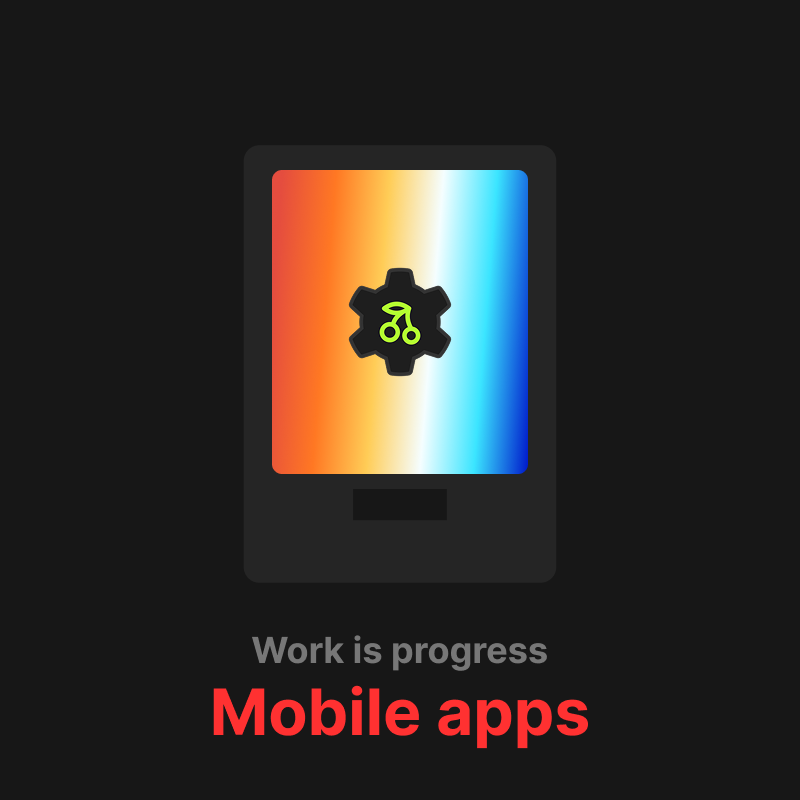
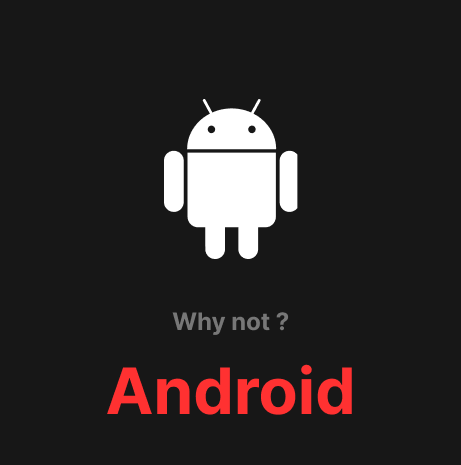

<a href="https://infinite.si">
  <h1 align="center">
    <picture>
      <source media="(prefers-color-scheme: dark)" srcset="./.github/imgs/banner.png">
      
    </picture>
  </h1>
</a>

<div align="center">
<a title="Code Quality" href="https://www.codefactor.io/repository/github/infinitehq/uikit"></a>
  <a title="Discord Server" href="https://discord.gg/H2wptkecUg"></a>
<a title="'Linux Build' workflow Status" href="https://img.shields.io/github/actions/workflow/status/infiniteHQ/uikit/build.yml"></a>
</div>

> *Important: Cherry is part of [Infinite](https://infinite.si/)'s initiative to create free, independent, and ethical technology and computing. Cherry is a library powering many parts of this project, but maintaining libraries like Cherry is a time-consuming and costly process. If you appreciate Cherry, you can support us [on our funding page](https://fund.infinite.si/) if you can.*

### Summary
*Cherry is a modern, minimalist yet comprehensive UI/UX framework for low-level native applications. It provides a complete solution, including backend support, a rendering engine, and UI components. Cherry is built using technologies like ImGui, Vulkan, and SDL, offering developers advanced tools to create efficient and high-performance interfaces.*

### What you can do ?
<table>
  <tr>
    <td>
      
      
      
      
      
      
      
    </td>
  </tr>
</table>

### Compatibility ?
<table>
  <tr>
    <td>
      
      
      
      
      
      
    </td>
  </tr>
</table>

### Documentation

## Examples & Preview
  
> [!NOTE]  
> These examples are real-world examples of the use of Cherry. More examples will be uploaded.
<table>
  <tr>
    <td align="center">
      
      <p>Simple window with sidebar</p>
    </td>
    <td align="center">
      
      <p>Toast notification</p>
    </td>
    <td align="center">
      
      <p>Rich menubar</p>
    </td>
  </tr>
  <tr>
    <td align="center">
      
      <p>Project selector with custom widgets</p>
    </td>
    <td align="center">
      
      <p>Item selection & navigation</p>
    </td>
    <td align="center">
      
      <p>Rich windows & Docking</p>
    </td>
  </tr>
  <tr>
    <td align="center">
      
      <p>Multi-windows on single app</p>
    </td>
  </tr>
</table>

## Features

> **Components & Kits**
> - 🧰 Many single components ready to use with data managment
> - 📦 Many all in one windows, ready to use and manage
> - 📦 ImGui abstractions for simplicity
> - 📦 SDL abstractions for inputs & user managment
> - 📦 Short inlines components

> **Render engine**
> - 📈 Data handler for windows & components
> - 💬 Localization & Traduction managment
> - 🎨 Themes manager, Dark & Ligth themes
> - ❓ Fonts manager
> - 🖼️ Images & textures manager
> - 🗂️ Menubar & Bottombar simple callbacks
> - 💪 Custom window close behaviors
> - 🗄️ Advanced Docking (WIP)
> - 🖼️ Toasts, Notifications & pop-ups
> - 🛠️ Behaviros callbacks (closing, moving, etc...)
> - 🏗️ Windows customisations (size, colors, properties & styles)

> **Backends**
> - 🛠️ Multi context with contexts cohesion & communication (ImGui/SDL)
> - 🛠️ Complete image load & show, cache & optimization
> - 🛠️ Window builder


> **Planned features for next updates :**
> - 🏗️ Webviews & Website loading
> - 🏗️ More components with more properties & customizations
> - 🏗️ Internet images loading & cache managment


> [!NOTE]  
> This framework is new and still under active development, so some bugs may occur, and content is subject to change. We are also working to improve the overall stability of Cherry, particularly with regard to memory safety and the rendering stack, as well as the graphical libraries used. Thank you for your understanding! Stay tuned :)

## Getting started
> [!WARNING]  
> The only dependance you need to compile Cherry is the VulkanSDK installed & ready. Please refer to the https://www.lunarg.com/vulkan-sdk/ website to see how install Vulkan on your system (compatible on Linux & Windows).


> 🪟 On **Microsoft Windows**
> ```
> git clone https://github.com/infiniteHQ/Cherry
> cd Cherry
> git submodule update --init --recursive
> cd example/demo
> build.bat
> ```


> 🐧 On **Linux** based distributions
> ```
> git clone https://github.com/infiniteHQ/Cherry
> cd Cherry
> git submodule update --init --recursive
> cd example/demo
> bash build.sh
> ```

### About tech
*The core of Cherry is made with C and C++, but you can easely integrate the framework in many stacks configurations with many other languages or techs.*
<div style="display: flex; align-items: center;">
  <picture>
    <source media="(prefers-color-scheme: dark)" srcset="./.github/imgs/Graph.png">
    
  </picture>
</div>

At the low level, we have all the backends, including Vulkan and SDL contexts, handling input management, event dispatching, and Vulkan-accessible resources such as the swapchain, framebuffers, etc. At the upper level, we have the Cherry render engine, whose role is to manage, create, and delete OS windows, while providing user-level windows within these OS windows. Additionally, we ensure seamless coordination for an optimal user experience.

Within these user-side windows, we include all components and widgets, along with a robust system for complete user data management. The entire stack is highly optimized to ensure the best performance and maximum stability.

## Special thanks
- For all contributors of SDL2
- For all contributors of Vulkan/VulkanSDK
- For all contributors of STB
- For the log library of gabime and contributors (https://github.com/gabime/spdlog)
- For the json library of nlohmann and contributors (https://github.com/nlohmann/json)
- For the amazing immediate mode interface ImGui from Ocornut and contributors (https://github.com/ocornut/imgui)
- For the work of from "Studio Cherno" on Walnut (https://github.com/StudioCherno/Walnut)
