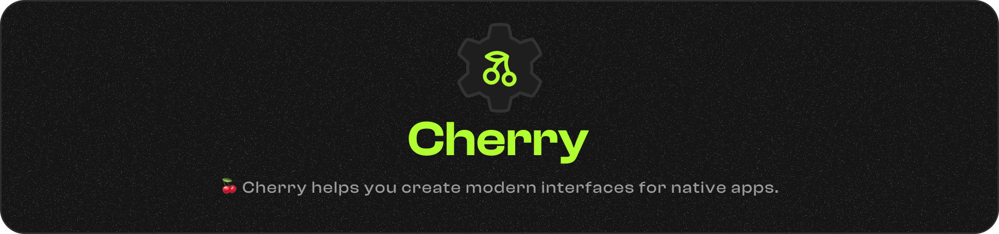

<a href="https://cherry.infinite.si">
  <h1 align="center">
    <picture>
      <source media="(prefers-color-scheme: dark)" srcset="./.github/imgs/banner.png">
      
    </picture>
  </h1>
</a>

<div align="center">
<a title="Code Quality" href="https://www.codefactor.io/repository/github/infinitehq/cherry"></a>
  <a title="Discord Server" href="https://discord.gg/H2wptkecUg"></a>
<a title="'Linux Build' workflow Status" href="https://img.shields.io/github/actions/workflow/status/infiniteHQ/cherry/build.yml"></a>
    <a title="Changelog" href="https://changelogs.infinite.si/cherry"></a>

  <a title="Latest Release" href="https://github.com/infiniteHQ/Cherry/releases/latest"></a>
  <a title="Documentation" href="https://infinite.infinite.si/"></a>

</div>

### What is Cherry ?
Cherry is a modern, minimalist framework for building cross-platform application or cool user interfaces.
It avoids heavy web technologies and bloated solutions, focusing instead on being simple yet complete, powered by **ImGui, Vulkan, and SDL**.  
Whether you’re a beginner or an experienced developer, Cherry makes it easy to create real, efficient, and professional interfaces. 

> *Important: Cherry is part of [Infinite](https://infinite.si/)'s initiative to create free, independent, and ethical technology and computing. Cherry is a library powering many parts of this project, but maintaining libraries like Cherry is a time-consuming and costly process. If you appreciate Cherry, you can support us [on our funding page](https://fund.infinite.si/) if you can.*


## All Features

> - 🧰 **80+ Components**, easy and ready to use  
> - 📗 **60+ Drawing effects**,
> - 🎨 **20+ Style effects & utilities**, including colors, sizes, padding, and layout management  
> - 📦 **13+ examples** and ready to use windows, concepts to learn quiclky.
> - 🌈 **8 Built-in themes**, with full color palettes and properties  
> - 🛠️ **Unlimited customization**: create your own **components, style effects, and themes**, either through the **low-level drawing API** for maximum control, or from **prefabricated building blocks** for faster development  
> - 📜 **Scripting engine** with Lua, allowing live scripting, easy UI builds and simplier way of building interfaces !
> - 🪛 **Many logics and interaction** utils like input detection, key managment, double click, Ctrl+C etc...
> - 📦 **Complete and simple API** with Sound managment, web asset fetching, rendering possibilities, traduction managment etc...

> **Core engine**
> - 🔊 **Sound engine**
> - 📜 **Scripting engine with lua**
> - 📜 **Complete drawing API (C++ and Lua)**
> - 🎨 **Themes manager, Dark & Ligth themes**
> - 📈 **Data handler for windows & components**
> - 🌍 **Localization & Translation management**  
> - 🔤 **Fonts management**  
> - 🌐 **Network media & Web assets**  
> - 📦 **Assets management**  
> - 🖼️ **Images & textures manager**
> - 🗂️ **Menubar & Bottombar simple callbacks**
> - 💪 **Custom window close behaviors**
> - 🗄️ **Advanced Docking**
> - 🖼️ **Toasts, Notifications & pop-ups**
> - 🛠️ **Behaviros callbacks** (closing, moving, etc...)
> - 🏗️ **Windows customisations** (size, colors, properties & styles)

> **Backends**
> - 🛠️ Multi context with contexts cohesion & communication (ImGui/SDL)
> - 🛠️ Complete image load & show, cache & optimization
> - 🛠️ Window builder


<a href="https://cherry.infinite.si">
  <h3 align="center">
    <picture>
      <source media="(prefers-color-scheme: dark)" srcset="./.github/imgs/component_banner.png">
      
    </picture>
  </h3>
</a>

<a href="https://cherry.infinite.si">
  <h3 align="center">
    <picture>
      <source media="(prefers-color-scheme: dark)" srcset="./.github/imgs/theme_banner.png">
      
    </picture>
  </h3>
</a>
<a href="https://cherry.infinite.si">
  <h1 align="center">
    <picture>
      <source media="(prefers-color-scheme: dark)" srcset="./.github/imgs/style_banner.png">
      
    </picture>
  </h1>
</a>

> [!NOTE]  
> This framework is new and still under active development, so some bugs may occur, and content is subject to change. We are also working to improve the overall stability of Cherry, particularly with regard to memory safety and the rendering stack, as well as the graphical libraries used. Thank you for your understanding! Stay tuned :)

## Getting started
> [!WARNING]  
> The only dependance you need to compile Cherry is the VulkanSDK installed & ready. Please refer to the https://www.lunarg.com/vulkan-sdk/ website to see how install Vulkan on your system (compatible on Linux & Windows).


> 🪟 On **Microsoft Windows**
> ``` powershell
> git clone https://github.com/infiniteHQ/Cherry
> cd Cherry
> git submodule update --init --recursive
> cd examples/hello
> build.bat
> .\build\bin\hello.exe
> ```

> 🐧 On **Linux** based distributions
> ``` bash
> git clone https://github.com/infiniteHQ/Cherry
> cd Cherry
> git submodule update --init --recursive
> cd examples/hello
> bash build.sh
> ./build/bin/hello
> ```

*Congratulations! If everything is working well, you can now start in the Cherry environment. Please follow our [documentation](https://cherry.infinite.si/). If you encounter any issues, feel free to ask your question or reach out to us on [Discord](https://discord.gg/H2wptkecUg)!*

<h2>Compatibility</h2>

<table style="width:100%;">
  <tr>
    <th>Technology</th>
    <th>Windows</th>
    <th>Linux</th>
    <th>Linux DRM</th>
    <th>macOS</th>
    <th>iOS</th>
    <th>Android</th>
    <th>Web</th>
  </tr>
  <tr>
    <td><strong>Vulkan</strong></td>
    <td>✅</td>
    <td>✅</td>
    <td>🟧</td>
    <td>✅</td>
    <td>❌</td>
    <td>❌</td>
    <td>❌</td>
  </tr>
</table>

<p style="font-size: 12px;">
✅ <em>: Fully compatible</em><br>
🟧 <em>: Not fully tested, partially incompatible but planned</em><br>
❌ <em>: Not planned, incompatible (for the moment...)</em>
</p>

## Examples & Preview

Cherry is already used in real-world projects, such as:  
- [**The Vortex Creation Platform**](https://vortex.infinite.si)  
- [**Vortex Launcher**](https://github.com/infiniteHQ/VortexLauncher)  
- [**Vortex Installer**](https://github.com/infiniteHQ/VortexInstaller)  

> [!NOTE]  
> More examples and previews will be uploaded soon.  


## Special thanks
- For all contributors of SDL2
- For all contributors of Vulkan/VulkanSDK
- For all contributors of STB
- For the log library of gabime and contributors (https://github.com/gabime/spdlog)
- For the json library of nlohmann and contributors (https://github.com/nlohmann/json)
- For the amazing immediate mode interface ImGui from Ocornut and contributors (https://github.com/ocornut/imgui)
- For the work of from "Studio Cherno" on Walnut (https://github.com/StudioCherno/Walnut)
