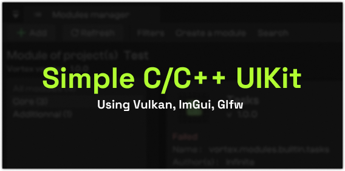

<a href="https://infinite.si">
  <h1 align="center">
    <picture>
      <source media="(prefers-color-scheme: dark)" srcset="./banner.png">
      
    </picture>
  </h1>
</a>

<a title="Code Quality" href="https://www.codefactor.io/repository/github/infinitehq/uikit"></a>


This is a simple & low level UI Kit for moderns low level applications running with a graphical user interface.


## Buinding example
```
cd example
mkdir build && cd build
cmake ..
make
```


## Features
- Immediate rendering with advanced layer management.
- Custom widgets
- ImGui mods & addons.

## Special thanks
- The amazing immediate mode interface ImGui from Ocornut (https://github.com/ocornut/imgui)
- A ImGui all in one base from "Studio Cherno" (https://github.com/StudioCherno/Walnut)